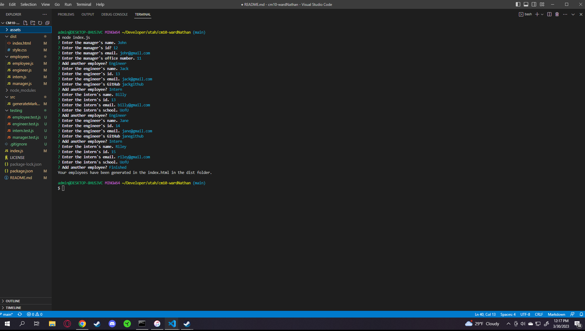

# Team Profile Generator

## Description

I wanted a way to keep track of all my employees and their information that displays it on an html.

## Installation 

For the program to operate the user must insert the following into their command line:
npm i inquirer@8.2.4
npm i jest

## Usage

To use the program insert the following into the command line:
node index.js

and follow the prompts

## Credits

N/A

## Tests

In the command line insert:

npm test

to verify that everything is working correctly

## Questions

Please feel free to contact me either on Github or at my email.

## Links and Images

https://github.com/wardNathan/cm10-wardNathan
https://drive.google.com/file/d/1733eahg841g6vzL1mM0pwS6to53wBijB/view?usp=sharing
